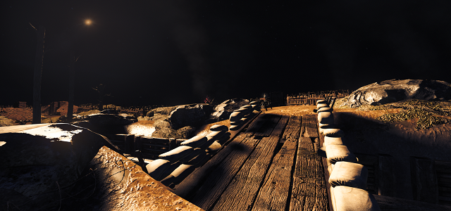

# Amnesia: The Bunker Mod

## The Night Window

### Concept

"A message must be delivered before dawn, be quick and quiet."

The Night Window is a custom-story mod for Amnesia: The Bunker inspired by [the movie 1917 - The Night Window scene](https://www.youtube.com/results?search_query=1917+the+night+window). It is also heavily inspired by the "No man's land" main game map.

It is an idea I had after playing the main game and a small concept of what an outside level could look like. Its supposedly take place after the bad-game ending.

It is a single level story, and it is not supposed to be too difficult, as once you learn the map layout and finished it once, you can probably finish it in around 15 mins.
This map use a custom-edited Stalker which will hunt you down the whole time.

It is a night map, so it is obviously better played in a dark room. It is also supposed to be played with Shadows at Medium or higher but of course works with every settings. Feel free to change the Gamma as you please.

### Download

* [Steam Workshop (recommended)](https://steamcommunity.com/sharedfiles/filedetails/?id=3813989622)
* [Github](https://github.com/ScrappyCocco/Amnesia_TheNightWindow_Public/releases)
* [Nexus Mods](https://www.nexusmods.com/amnesiathebunker/mods/49)

### Settings

I suggest you finish the map without enabling NewGame+ the first time, at normal difficulty.

NewGame+ is not fully supported, the best options you can change are:

* Enable/Disable Saving
* Traps amount
  * At "None" will remove every trap;
  * At higher than normal will add extra traps.
* Resources amount
  * If lower than default will reduce the resources making the map more difficult; (you will understand once you finish it once at normal).
* Stalker/Rats parameters

You can play with the other options but I cannot guarantee everything will work, as for example there is not a generator in the map so generator-dependent options will have no effect.

### Issues and suggestions

I tested the map myself multiple times, but if you get stuck somewhere, cannot finish the map or the Stalker gets broken somewhere please report the issue so I can try to fix it, thanks.

### Thank you for playing
